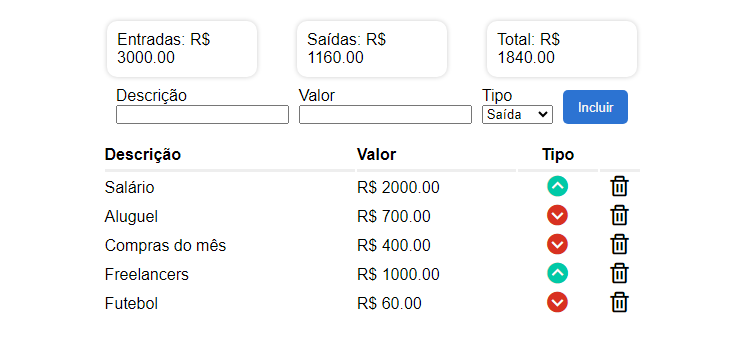

# Projeto controle de finanças

## Projeto desenvolvido com auxílio do canal no Youtube chamado [Will Dev](https://youtu.be/if0KcjYFm-Y?si=r3b5I5XunLbBiy-R), uma excelente forma para praticar minha leitura de código em Javascript e também botar em prática algumas melhorias ao projeto.

---
## Ideias iniciais:
- Aprender a fazer um CRUD simples porém muito funcional.
- Conhecer mais a respeito de algumas funções nativas para manipulações de arrays.
- Leitura de código para entender o processo de toda lógica sendo estruturada no projeto.
- Armazenar Entradas e saídas em localStorage para dar vida a aplicação.
---
## Tecnologias Utilizadas:
- HTML
- CSS
- JAVASCRIPT